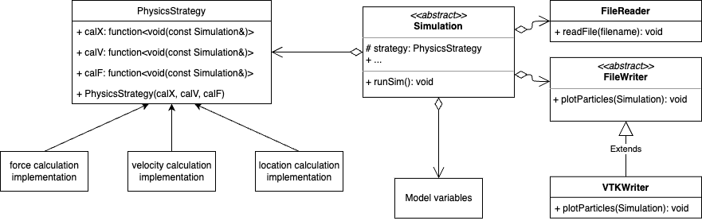

MolSim Group F
===

## Group members
- [Noah Schlenker](https://github.com/noahpy)
- [Jimin Kim](https://github.com/jimin31)
- [Christian Nix](https://github.com/Chryzl)

## Build instructions
To build the project, run the following commands:
```
mkdir build && cd build
cmake ..
make
```

## Run instructions
To run the project, run the following command:
```
src/MolSim -d <delta_t> -e <end_t> ../input/<input_file>
```
For more information about arguments and default settings, type:
```
src/MolSim -h
```
## Generate Doxygen documentation
To generate the Doxygen documentation, run the following command:
```
make doc_doxygen
```
This will generate the documentation into the folder `doxys_documentation`.

## Run tests
To run the tests, run the following command:
```
make tests
tests/tests
```

## Format code
If your system has clang-format installed, the target `clangformat` will be created. You can then run:
```
make clangformat
```
to format the code.


## Project structure
The project is structured as follows:

Note that this is not a perfect UML diagram, but rather a visualization of the broad structure of the project.

**`Simulation`**
- Any kinds of a simulations are represented as a child class of the `Simulation` class
- Any simulation instance defines the `runSim()` function, which uses the I/O classes (`FileReader`, `FileWriter`), the `PhysicsStrategy` class and the model variables passed to it to calculate the simulation through time.
- Child simulations might extend with new model varibales their parent simulations.

**`PhysicsStrategy`**
- Strategy interface to different implementation of strategy functions
- Strategy functions are interchangable / compareable

**`FileWriter`**
- Template method class defining a common interface of different writers

**`FileReader`**
- Template method class defining a common interface of different readers
- Currently not abstract yet, as only one reader is existant

## Folder structure
This section describes the folder strcuture of this project:
- `tests`: tests of the project 
- `src`: source files of the project
- `src/io`: all source files relating to I/O
- `src/models`: all source files relating to classes representing parts of the model
- `src/physics`: all source files relating to physical calculations
- `src/simulation`: all source files relating to the `Simlation` class
- `src/MolSim.cpp`: source file holding main function

