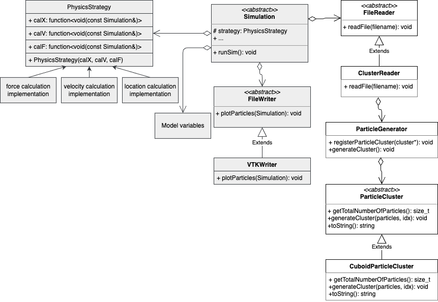

MolSim Group F
===


The molecular dynamics SS24 code base of Group F.  
You can find the doxygen documentation hosted on [https://noahpy.github.io/MolSim-SS24/](https://noahpy.github.io/MolSim-SS24/).

## Table of Contents
1. [Group members](#group-members)
2. [Quickstart](#quickstart)
    - [Build instructions](#build-instructions)
    - [Run instructions](#run-instructions)
    - [Generate Doxygen documentation](#generate-doxygen-documentation)
    - [Run tests](#run-tests)
    - [Run benchmarks](#run-benchmarks)
    - [Format code](#format-code)
    - [Open man page](#open-man-page)
3. [Documentation](#documentation)
    - [Project structure](#project-structure)
    - [Folder structure](#folder-structure)

## Group members
- [Noah Schlenker](https://github.com/noahpy)
- [Jimin Kim](https://github.com/jimin31)
- [Christian Nix](https://github.com/Chryzl)


## Quickstart
### Build instructions
To build the project, run the following commands:
```
mkdir build && cd build
cmake ..
make
```
To build without doxygen and benchmarks run
```
cmake .. -DGENERATE_DOC=OFF  -DBUILD_BENCH=OFF
```
instead.

### Run instructions
To run the project (in general), run the following command:
```
src/MolSim -d <delta_t> -e <end_t> ../input/<input_file>
```
#### Assignment 1 simulation
```
src/MolSim ../input/eingabe-sonne.txt -e 1000 
```
#### Assignment 2 simulation
```
src/MolSim ../input/clusters.txt -c -s 1 -d 0.0002 -e 5
```
#### Assignment 3 simulation
Cuboid collision:
```
src/MolSim ../input/assign3.xml -x -s 3
```
Falling drop:
```
src/MolSim ../input/falling_drop.xml -x -s 3
```

For more information about arguments and default settings, type:
```
src/MolSim -h
```
or read the [man page](#open-man-page)
### Generate Doxygen documentation
To generate the Doxygen documentation, run the following command:
```
make doc_doxygen
```
This will generate the documentation into the folder `doxys_documentation`.

### Run tests
To build the tests run:
```
cd build
make tests
```
To run the tests, run the following command:
```
tests/tests
```
Or alternatively with ctest:
```
ctest --test-dir tests
```

### Run benchmarks 
The benchmarks are run using [Google benchmark](https://github.com/google/benchmark).
Build:
```
cd build
make benchmarks
```
Run:
```
bench/benchmarks
```

### Format code
If your system has clang-format installed, the target `clangformat` will be created. You can then run:
```
make clangformat
```
to format the code.

### Open man page
To see more details on how to use the program, you can look at our man page.
Enter the project root and then run:
```
man ./.molsim.1
```

## Documentation

### Project structure
The project is structured as follows:

Note that this is not a perfect UML diagram, but rather a visualization of the broad structure of the project.

**`Simulation`**
- Any kinds of a simulations are represented as a child class of the `Simulation` class
- Any simulation instance defines the `runSim()` function, which uses the I/O classes (`FileReader`, `FileWriter`), the `PhysicsStrategy` class and the model variables passed to it to calculate the simulation through time.
- Child simulations might extend with new model varibales their parent simulations.

**`PhysicsStrategy`**
- Strategy interface to different implementation of strategy functions
- Strategy functions are interchangable / compareable

**`FileWriter`**
- Template method class defining a common interface of different writers

**`FileReader`**
- Template method class defining a common interface of different readers
- Currently not abstract yet, as only one reader is existant

**`ParticleCluster`**
- Represents a cluster of particles that can be used to initialize the simulation
- Based on an abstract `ParticleCluster` class
- Child classes include e.g. `CuboidParticleCluster` used in problem sheet 2

### Folder structure
This section describes the folder strcuture of this project:
- `tests`: tests of the project 
- `src`: source files of the project
- `src/io`: all source files relating to I/O
- `src/models`: all source files relating to classes representing parts of the model
  -  `src/models/generators`: all source files related to generating initial particle clusters
- `src/physics`: all source files relating to physical calculations
- `src/simulation`: all source files relating to the `Simlation` class
- `src/MolSim.cpp`: source file holding main function

